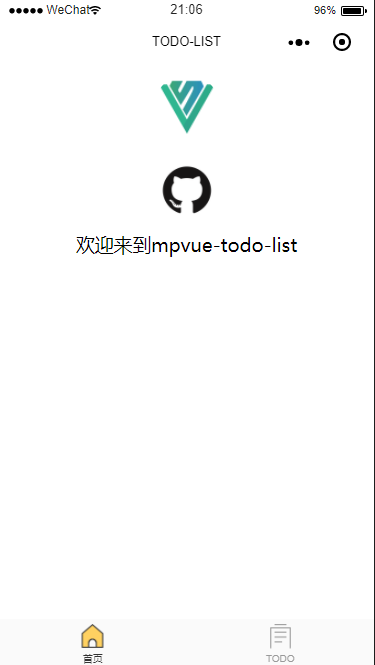
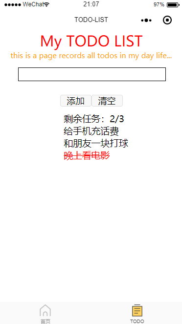

# mpvue-todo-list

> 初学mpvue构建一个todo-list微信小程序

## 一、功能介绍
### 首页

### TODO页面

关于TODO页面的功能，和[vue-todo-list](https://github.com/zhangxun165/vue-todo-list)中的一模一样。

## 二、命令执行
### 安装依赖包
npm install

### 本地运行
npm run dev
